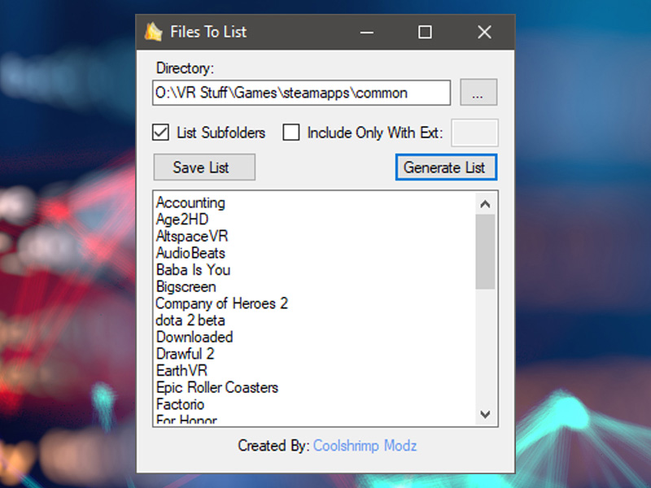

# Files-To-List

Easily generate a list of all files within any specified directory—perfect for quickly cataloging folders full of files, movies, and more.

---

## Features

- **Directory Selection**: Browse for the folder you want to list.
- **Extension Filtering**: Optionally include only specific file types.
- **Subfolder Inclusion**: Toggle whether to include files in subfolders.
- **Simple Output**: Copy, paste, or save the generated file list for easy reference.

---

## Installation

**Requirements**:
- **Windows**  
- - **.NET Framwork 4.0** 
1. **Download** the latest release (an `.exe`) from the [Releases](./releases) section.
2. **Run** the `.exe`—no formal installation required.

---

## Usage

1. **Choose a Directory**: Select the folder to list.
2. **Adjust Settings** (Optional): Enable subfolders or filter by extension.
3. **Generate List**: View the file listing in the application.
4. **Save** (Optional): Export your file list as a `.txt` file if needed.

---

## Version History

### v1
- **Initial Release**

## Donate

If you’d like to support the development of tools like this, consider a donation:  
[**Support Me**](https://links.coolshrimpmodz.com)

---
